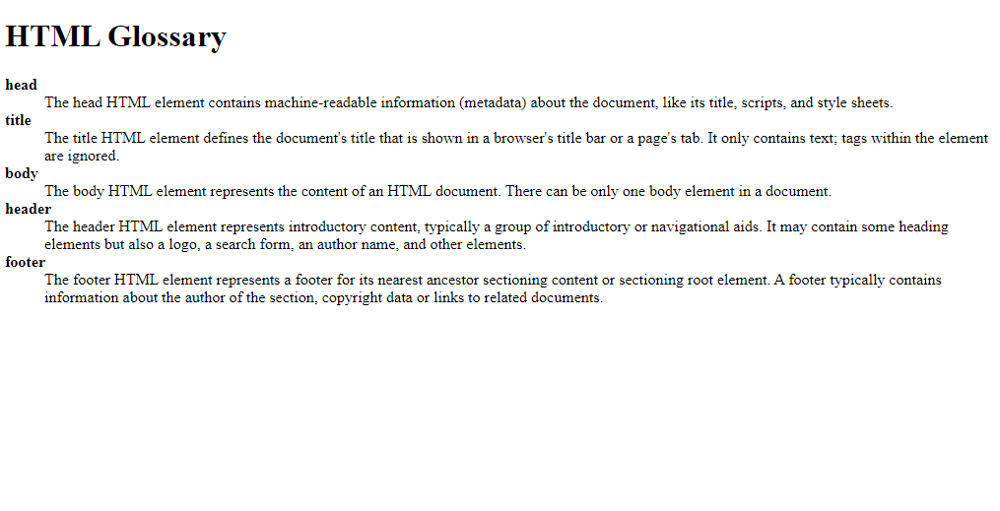

# HTML Basics

## About

Some HTML examples for teaching how to use tags like header, main, h1, h2, h3, dl, dt, and so on and so forth.

## Run

Install [Live Server extension](https://marketplace.visualstudio.com/items?itemName=ritwickdey.LiveServer), right click on each `.html` file and then click on `Open with Live Server`.

## Status

Done ✅

## License

[MIT](./LICENSE)
